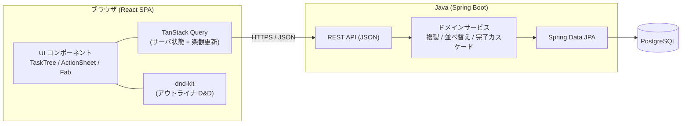
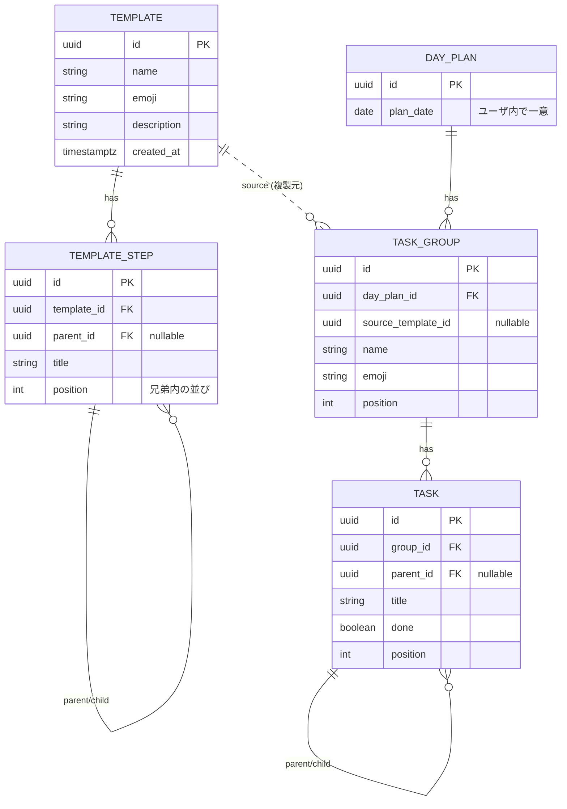

# ひな形タスク — 設計書 (React + Java)

現行モック（リポジトリ直下の `index.html`）の挙動をそのまま実プロダクトに落とし込むための設計。
フロントエンド **React (TypeScript)**、バックエンド **Java (Spring Boot)** を前提とする。

- ライブのモック: https://claude.ai/code/artifact/4096e48f-11b1-404b-bb01-ad00052b7e85
- モックは UX の唯一の正（source of truth）。実装は挙動を再現する。

---

## 1. プロダクト概要

「毎日の細かいタスクを、**再利用できるひな形（テンプレート）**として階層的に組み立て、
毎日それを**本日のタスク**に展開して実行する」ための TODO 特化アプリ。

2 つの画面（モード）で構成する。

| 画面 | 役割 | 状態 |
|---|---|---|
| **テンプレート** | 再利用する手順のひな形を階層的に編集 | 完了状態を持たない「設計図」 |
| **本日のタスク** | ひな形を適用し、当日のチェックリストとして実行 | 完了状態を持つ「実体」 |

---

## 2. 機能インベントリ（モックから）

実装で必ず再現する挙動。

### 共通
- 無制限にネスト可能な階層ツリー（親＝子の集合、葉＝末端）
- 同一階層でマーカー位置が揃う。折りたたみ機能は**無し**
- 行を**長押しでドラッグ開始**。上下で並べ替え、**左右で階層の上げ下げ**（アウトライナ方式）
- 行タップで操作シート（サブ項目追加 / 名前変更 / 削除）、ダブルタップでインライン編集
- 右下 FAB で新規追加、下部タブバーでモード切替、ライト / ダークテーマ

### テンプレート
- テンプレート = 絵文字・名前・説明・ステップのツリー
- 一覧（カード）→ タップで編集画面へドリルイン
- ステップの追加 / 改名 / 削除 / 並べ替え / 階層変更
- 「本日のタスクに追加」でツリーを丸ごと当日へ複製

### 本日のタスク
- 日付ヘッダ、当日全体の達成率リング
- 適用したテンプレートごとに「グループ（束）」を表示（＋「個別のタスク」束）
- タスクの完了チェック（**親をチェックすると子孫も一括、親の完了は子孫から導出**）
- 親に進捗バーと完了数（`完了葉 / 全葉`）
- タスクの追加 / 改名 / 削除 / 並べ替え / 階層変更、束の削除

---

## 3. アーキテクチャ全体像



- **フロント**: React SPA。サーバ状態は TanStack Query で取得・キャッシュし、D&D や完了トグルは**楽観更新**で即時反映 → 失敗時ロールバック。
- **バック**: Spring Boot の REST API。階層の複製・並べ替え・完了カスケードなど「木構造の整合性」をサーバ側ドメインサービスに集約。
- **DB**: PostgreSQL。木は隣接リスト（`parent_id` + `position`）で表現。

---

## 4. 技術スタック

### フロントエンド
| 領域 | 採用 | 理由 |
|---|---|---|
| 言語 / ビルド | TypeScript + Vite | 型安全・高速 HMR |
| UI | React 18 | モックのコンポーネント指向をそのまま移植 |
| ルーティング | React Router | `/templates`, `/templates/:id`, `/today` |
| サーバ状態 | TanStack Query | キャッシュ・楽観更新・再取得を標準化 |
| D&D | `@dnd-kit/core` + `@dnd-kit/sortable` | flatten + 投影方式でモックのアウトライナ挙動を再現 |
| スタイル | CSS Modules または Tailwind | モックの CSS 変数（トークン）を移植 |
| テスト | Vitest + Testing Library / Playwright | 単体・結合・E2E |

### バックエンド
| 領域 | 採用 | 理由 |
|---|---|---|
| 言語 | Java 21 | LTS |
| フレームワーク | Spring Boot 3 (Web, Validation) | 標準的な REST |
| 永続化 | Spring Data JPA (Hibernate) | エンティティ⇔テーブルの素直なマッピング |
| DB | PostgreSQL | 階層・トランザクション |
| マイグレーション | Flyway | スキーマのバージョン管理 |
| ビルド | Gradle | （既存 `.gitignore` が Gradle 前提） |
| テスト | JUnit 5 + Testcontainers | 実 DB で結合テスト |

---

## 5. ドメインモデル

テンプレート側と当日側で、**構造は同型（木）だが状態が異なる**（テンプレは完了なし、当日は完了あり）。
コードでも「木のふるまい」は共通化しつつ、エンティティは分ける。



### 階層の表現方針
- **隣接リスト（`parent_id`）+ 兄弟内 `position`** を採用。実装が素直でモックのモデルと 1:1。
- 深さ・祖先判定はアプリ側で再帰、または読み出し時に木を組み立てる（1 テンプレ / 1 日分は小さいので N+1 は問題になりにくい。必要なら `template_id` / `group_id` 単位で一括 SELECT → メモリ上で組み立て）。
- 並び順 `position` は整数。並べ替え時はサーバで対象の兄弟列を再採番（後述）。
  規模が大きくなるなら **fractional indexing（LexoRank 風）** に差し替え可能な設計にしておく。

### 導出値（保存しない）
- 親の完了 = 「全葉が完了」。進捗 = `完了葉数 / 全葉数`。当日全体の達成率も同様。
- これらは API レスポンス組み立て時 or フロントで計算（モックと同じく葉ベース）。

---

## 6. REST API 設計

ベース `/, api/v1`。JSON。木は入れ子でシリアライズ。

### テンプレート
```
GET    /templates                     一覧（要約: id,name,emoji,description,stepCount）
POST   /templates                     作成 {name,emoji,description}
GET    /templates/{id}                完全なツリー
PATCH  /templates/{id}                メタ更新 {name?,emoji?,description?}
DELETE /templates/{id}

POST   /templates/{id}/steps          ステップ追加 {parentStepId?,title,index?}
PATCH  /steps/{stepId}                改名 {title}
DELETE /steps/{stepId}                （子孫ごと削除）
POST   /templates/{id}/steps/move     移動 {stepId,newParentStepId|null,newIndex}
```

### 本日のタスク
```
GET    /days/{date}                   その日のプラン（groups + tasks の木、進捗込み）
                                       例: /days/2026-07-20 、/days/today も可
POST   /days/{date}/apply             ひな形適用 {templateId} → TASK_GROUP を複製生成
DELETE /groups/{groupId}              束を当日から外す

POST   /groups/{groupId}/tasks        タスク追加 {parentTaskId?,title,index?}
PATCH  /tasks/{taskId}                改名 {title}
PATCH  /tasks/{taskId}/done           完了切替 {done} → 子孫へカスケード、親は導出
DELETE /tasks/{taskId}
POST   /groups/{groupId}/tasks/move   移動 {taskId,newParentTaskId|null,newIndex}
```

### 移動（`*/move`）の意味論
モックのアウトライナ D&D と一致させる。リクエストは「**移動対象・新しい親・親内での新しい位置**」の 3 点。
- サーバは対象サブツリーを付け替え（`parent_id` 更新）、新旧の兄弟列を再採番。
- 「自分の子孫を新しい親にできない」不正はサーバでも 400 で弾く（クライアントでも防止済み）。
- 1 リクエスト = 1 トランザクション。

### レスポンス例（`GET /days/2026-07-20`・抜粋）
```json
{
  "date": "2026-07-20",
  "progress": { "doneLeaves": 2, "totalLeaves": 5, "percent": 40 },
  "groups": [
    {
      "id": "…", "name": "朝のルーティン", "emoji": "☀️",
      "sourceTemplateId": "…",
      "progress": { "doneLeaves": 2, "totalLeaves": 4 },
      "tasks": [
        { "id": "…", "title": "水をコップ1杯飲む", "done": true, "children": [] },
        { "id": "…", "title": "今日の予定を確認する", "done": false,
          "children": [ { "id": "…", "title": "カレンダーを見る", "done": false, "children": [] } ] }
      ]
    }
  ]
}
```

---

## 7. バックエンド構成

```
backend/
  build.gradle
  src/main/java/app/
    template/   TemplateController, TemplateService, Template, TemplateStep, repos
    day/        DayController, DayService, DayPlan, TaskGroup, Task, repos
    tree/       TreeOps  … 木の共通操作（複製・移動・再採番・葉集計）をジェネリックに
    common/     例外ハンドラ, DTO, バリデーション
  src/main/resources/db/migration/  V1__init.sql …
```

### 中核ドメインサービス
- **applyTemplate(date, templateId)**: テンプレのツリーを深さ優先でコピーし、新 ID・`done=false` で `TASK_GROUP`/`TASK` を生成（サーバ側ディープクローン。モックの `instantiate`/`cloneTree` に対応）。
- **move(nodeId, newParentId, newIndex)**: 付け替え + 兄弟再採番。祖先ループ検査。
- **setDone(taskId, done)**: 対象サブツリーの葉を一括更新（モックの `setSubtree`）。親完了は導出。
- **rollup(tree)**: `完了葉 / 全葉` を計算（モックの `leaves`/`doneCount`）。

### トランザクション / 整合性
- 移動・適用・カスケード完了は `@Transactional`。
- 楽観ロック（`@Version`）を各エンティティに付与し、同時編集の衝突を検知。

---

## 8. フロントエンド構成

```
frontend/
  src/
    app/        AppShell（下部タブ）, ルーティング, テーマ
    features/
      templates/  TemplateListPage, TemplateEditorPage, useTemplates hooks
      today/      TodayPage, GroupCard, useDay hooks
    components/
      TaskTree/   TaskTree, TaskRow  … モックの renderNode 相当（mode で分岐）
      ActionSheet, Fab, ProgressRing, ThemeToggle
    lib/         apiClient, tree（flatten/projection/rollup を共有）
    styles/      tokens.css（モックの CSS 変数を移植）
```

### 状態管理
- **サーバ状態**: TanStack Query（`templates`, `template/:id`, `day/:date` をキー化）。
- **UI 状態**: モード、選択中テンプレ、シート開閉、ドラッグ中状態はローカル（`useState`/Context）。
- **楽観更新**: 完了トグル・並べ替え・追加は即座にキャッシュを書き換え → mutation → 失敗で `invalidate`/ロールバック。体感はモック同様に即時。

### D&D（アウトライナ）
モックのアルゴリズムをそのまま `@dnd-kit` 上に実装する。
1. 表示ツリーを **flatten**（`{id, depth, parentId}` の一次元列）。
2. ドラッグ中、ポインタ Y で挿入位置、X（開始からの水平移動 / `INDENT`）で目標 depth を算出。
3. `depth` を `[minDepth = 次要素の深さ, maxDepth = 前要素の深さ+1]` にクランプ（`lib/tree` に純関数として実装、テスト容易）。
4. flatten を再構築 → プレビュー描画。指を離したら `*/move` を叩いて確定（楽観更新）。
- 長押し起動 = `PointerSensor` の `activationConstraint: { delay, tolerance }`。
- モックの「浮きカード + 薄色スロット + 階層に合わせた横スナップ」を DragOverlay で再現。

### 純関数として共有するロジック（`lib/tree`）
`flatten`, `project(depth clamp)`, `rebuild`, `leaves`, `rollup`, `isDescendant`。
→ フロント（プレビュー）とバック（確定）で**同じ規則**を保つ。単体テストの中心。

---

## 9. 主要アルゴリズム（モック → 実装）

| モックの関数 | 実装先 | 概要 |
|---|---|---|
| `cloneTree` / `instantiate` | Backend `applyTemplate` | ツリー深いコピー・新 ID・`done=false` |
| `setSubtree` | Backend `setDone` | サブツリーの葉を一括完了 |
| `leaves`/`doneCount`/`nodeDone` | Front `lib/tree` + Backend `rollup` | 進捗導出 |
| flatten + 投影 + rebuild | Front `lib/tree` / Backend `move` | 並べ替え・階層変更 |
| `isDesc` ガード | 両方 | 自分の子孫への移動を禁止 |

---

## 10. 非機能・運用

- **認証（将来）**: MVP は単一ユーザ。マルチユーザ化は各テーブルに `user_id` を追加し、Spring Security + JWT/OAuth。API はユーザスコープでフィルタ。
- **バリデーション**: Bean Validation（title 必須・長さ上限、絵文字長など）。
- **エラー**: 統一エラーレスポンス（`{code,message}`）＋ `@RestControllerAdvice`。
- **マイグレーション**: Flyway（`V1__init.sql` 〜）。
- **テスト**:
  - Backend: サービス単体（JUnit）、API 結合（`@SpringBootTest` + Testcontainers/PostgreSQL）。特に move/apply/カスケードの木の不変条件。
  - Front: `lib/tree` の純関数を Vitest で網羅、コンポーネントを Testing Library、主要フローを Playwright（モックで使っている E2E をそのまま流用可能）。
- **CI**: Gradle test + npm test + Playwright を GitHub Actions で。
- **設定**: フロントの API ベース URL を環境変数化、CORS 設定。

---

## 11. リポジトリ構成（モノレポ）

```
template-maker/
  backend/     Spring Boot (Gradle)
  frontend/    React + Vite + TS
  index.html   PWA本体（HTML/CSS/JS 一体・UXの正）
  manifest.webmanifest, sw.js, icon-*.png  PWA アセット
  docs/        本設計書ほか
```

---

## 12. 段階的ロードマップ

1. **基盤**: モノレポ雛形、DB スキーマ（Flyway V1）、`lib/tree` 純関数 + テスト、API スケルトン。
2. **テンプレート CRUD**: 一覧・編集・ステップ追加/改名/削除、一覧⇔編集ナビ。
3. **D&D**: アウトライナ並べ替え・階層変更（フロント投影 + `*/move` 永続化）。
4. **本日のタスク**: 適用（複製）、完了カスケード、進捗ロールアップ、束の追加/削除。
5. **仕上げ**: 楽観更新の詰め、テーマ、FAB/シート、E2E、CI。
6. **拡張余地**: 繰り返し（毎朝自動適用）、期限・リマインド、複数ユーザ、並び順の fractional 化。

---

> 本設計はモック（リポジトリ直下の `index.html`）の挙動を基準に更新する。UX に変更が入ったらモックを先に直し、本書と API/モデルを追従させる。
